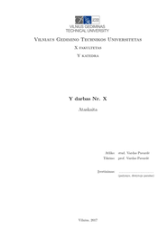
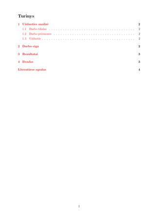
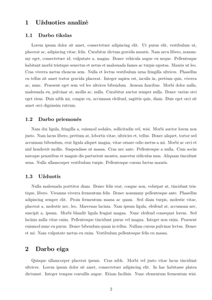
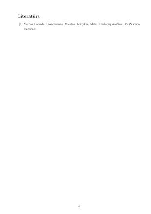
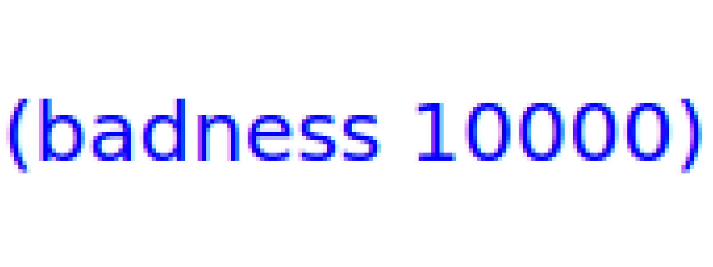

# LaTeX VGTU ataskaitos šablonas
   

## Naudojimo instrukcija

1. Reikės TeX redaktoriaus:
    * Specializuoto TeX redaktoriaus (TeXmaker, TeXworks) *arba*
    * online LaTeX redaktoriaus (ShareLaTeX, Overleaf) *arba*
    * naudoti teksto redaktorių (**VS Code**, Atom, Vim, Notepad++)

    Trečiuoju atveju reikės įsirašyti patį LaTeX (**TeX Live**, MikTeX) ir LaTeX papildinius teksto redaktoriuje.

2. Atsisiųskite .zip naudojant žalią **Download** mygtuką viršuje arba klonuokite repozitoriją naudojant `git clone`

3. Sukurkite failo `Template.tex` kopiją ir pervadinkite savo nuožiūra. Pvz. `Projektas1.tex`

4. Atidarykite failą savo pasirinktu TeX redaktoriumi ir pabandykite sukompiliuoti. Atkreipkite dėmesį į errorus log'e (jeigu jų yra) ir ištaisykite juos. LaTeX klaidas nurodo gan aiškiai, bet jeigu nepavyksta susidoroti, padeda internetas.

5. Preambulėje esančių paketų ir nustatymų dažniausiai keisti neprireikia, tačiau paketų sąrašą visad galima praplėsti, atkomentuoti/užkomentuoti esančius paketus ir nustatymus. LaTeX komentarai žymimi `%` ženklu.

6. Savaitę rašykite rašto darbą, įdėkite kelis kart daugiau pastangų negu šiaip reikia, pristatykite darbą dėstytojui, kuris jį pavartys kelias sekundes ir, kaip ir visiems, parašys 10, bet šiaip neįvertins jūsų pastangų, nes dėstytojai šiaip irgi žmonės, pavargę ir už absurdišką algą besiaukojantys žmonės. Prižadėkite sau kad daugiau neberašysite darbų LaTeX nes neverta. Vis tiek rašykite. Rinse and repeat.
